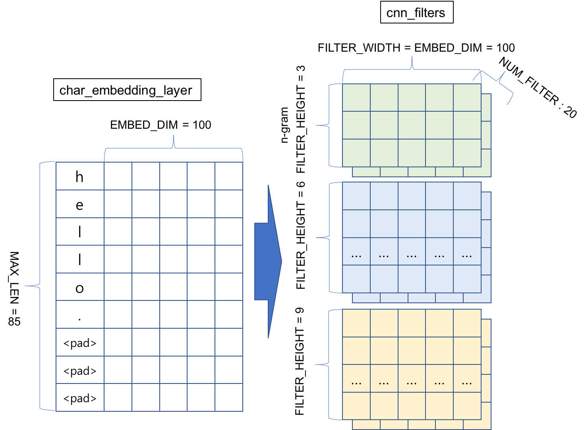
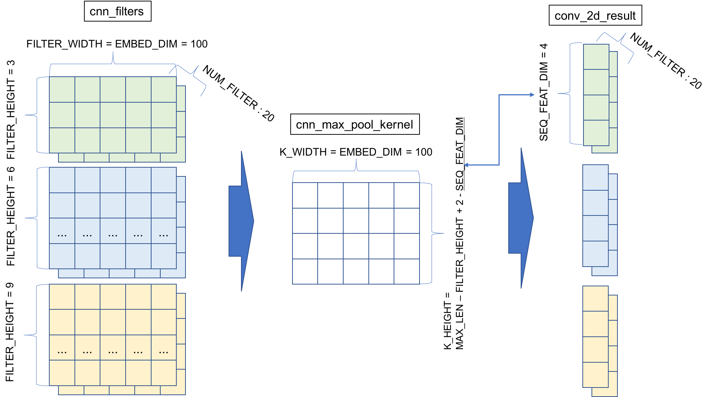
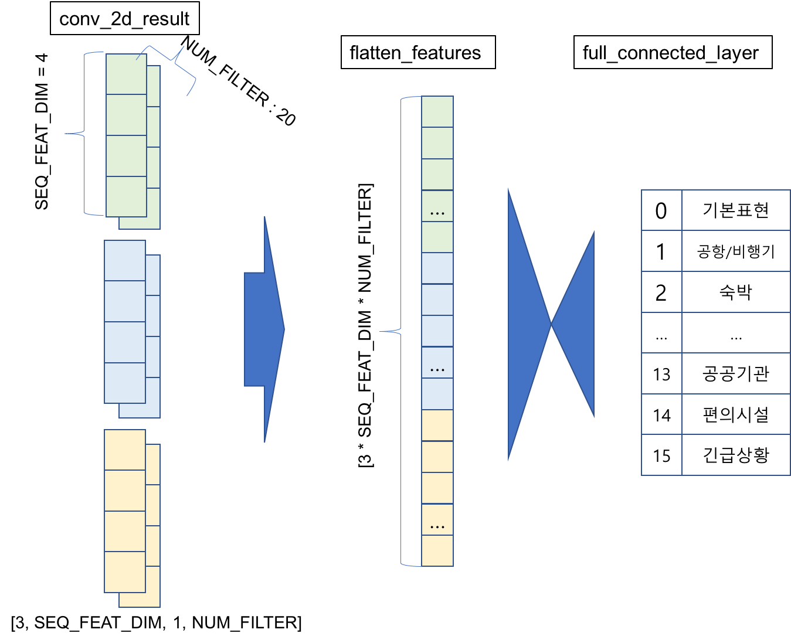
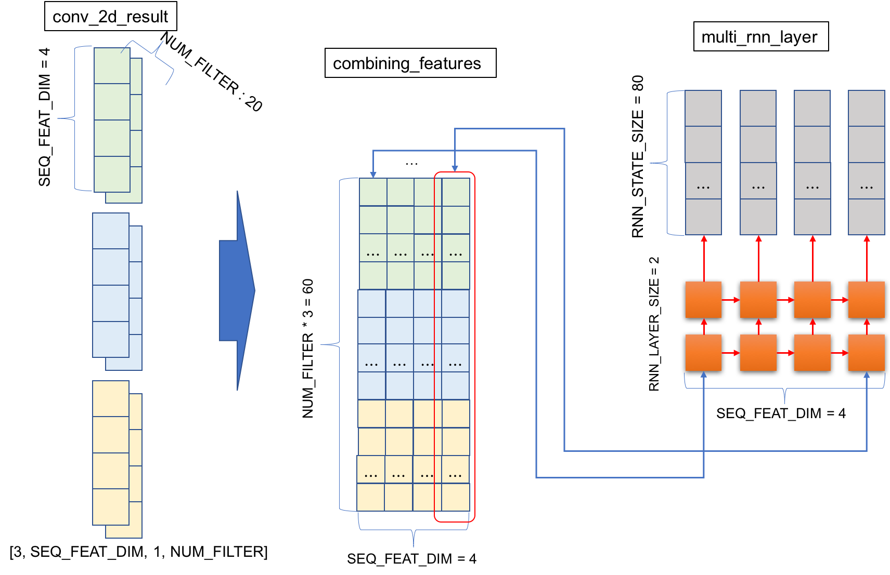
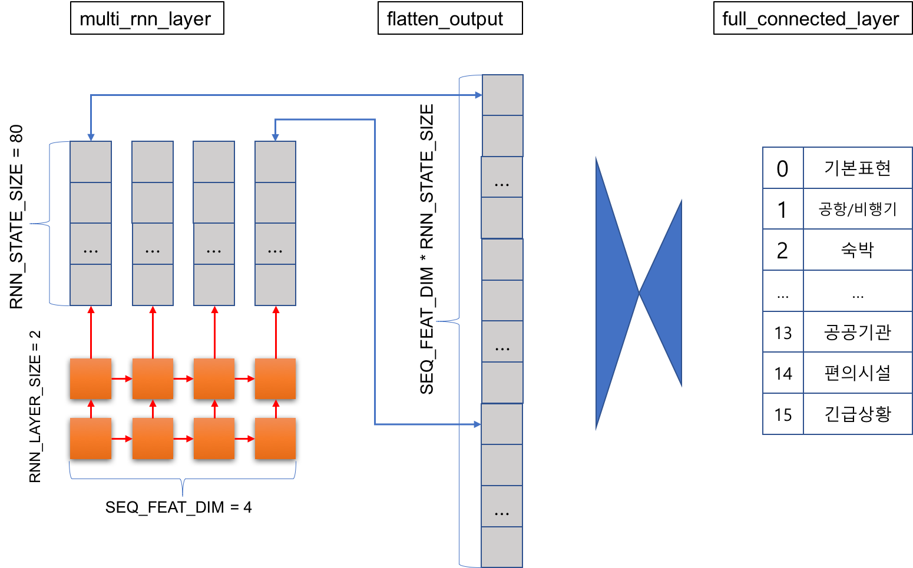
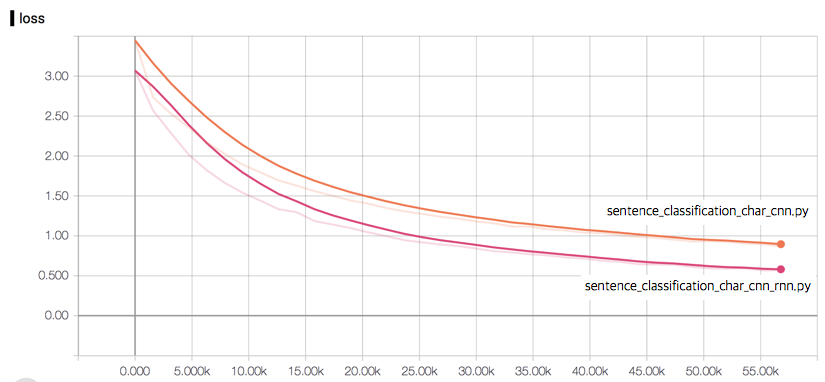
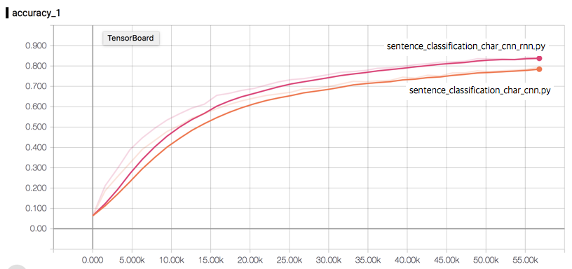
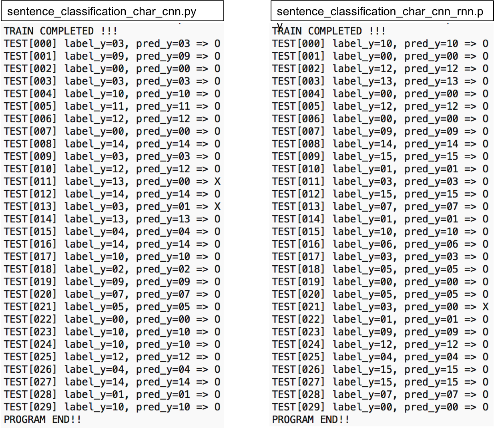
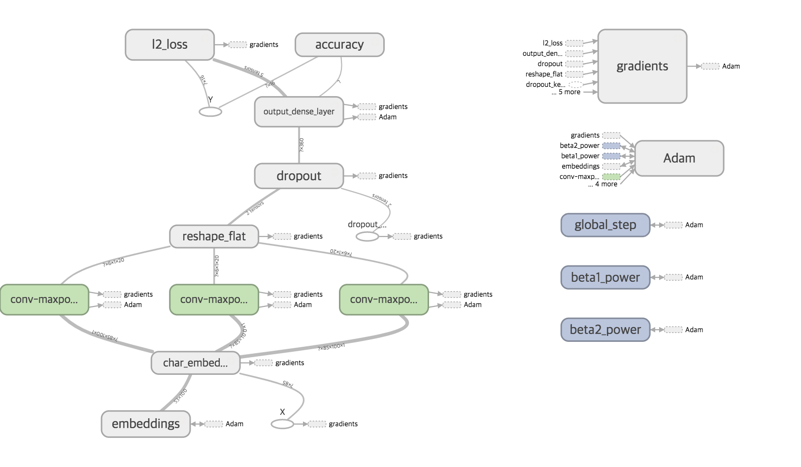
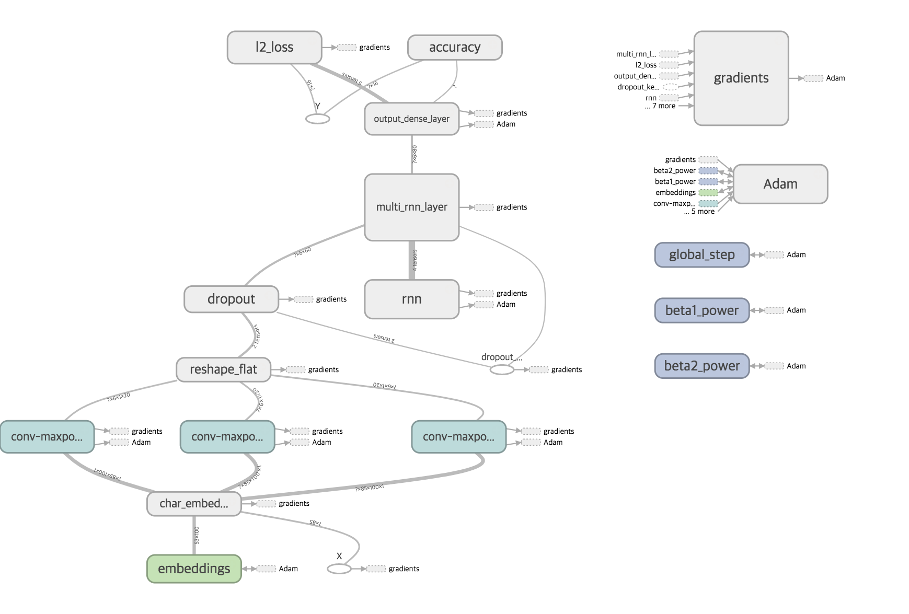

# Implementing a sentence classification using Char level CNN & RNN

#### cuteboydot@gmail.com

#### reference
1. [Character-level Convolutional Networks for Text Classification, Xiang Zhang](https://papers.nips.cc/paper/5782-character-level-convolutional-networks-for-text-classification.pdf)
2. [Convolutional Neural Networks for Sentence Classification, Yoon Kim](https://arxiv.org/pdf/1408.5882.pdf)
3. [Understanding Convolutional Neural Networks for NLP, WILDML](http://www.wildml.com/2015/11/understanding-convolutional-neural-networks-for-nlp/)

#### data reference
1. [네이버 글로벌회화](http://phrasebook.naver.com/detail.nhn?bigCategoryNo=2&targetLanguage=en)

### 1. Char 레벨의 CNN과 RNN을 이용한 문장 분류기
네이버 글로벌회화 페이지에서는 카테고리별 영어 문장을 소개하고 있다.  
총 16개의 카테고리를 다음과 같이 정리할 수 있다.  
0(기본표현) : Hello. Nice to meet you.  
0(기본표현) : How are you doing?  
...  
15(긴급상황) : Your car has been towed.  
15(긴급상황) : My car was towed, I'd like to reclaim it.  
  
위 문장 데이터셋을 학습하여 영어문장이 입력으로 들어왔을때 어떤 카테고리인지 분류할 수 있는 모델을 만든다.  
보통은 단어(word)단위로 학습을 수행하지만, 이번에는 글자(char)단위로 학습하도록 한다.  
  
input data : 영어 문장의 character embeddings  
output data : 문장 카테고리 번호  
  
sentence의 max_len은 최대 문장길이를 기준으로 하며, 문장이 끝난뒤 이후 공백은 zero-padding을 적용하여 처리한다.  
  
입력데이터로 one-hot vector가 아닌 embedding vector를 사용하였다.  
각 글자마다 embedding vector를 가중치처럼 사용하며, 처음에는 임의의 값으로 시작하여 학습 과정에서 점차 값이 변하게 된다.  
  
이후부터 학습모델을 2개를 생성한다.  
1) char-embedding -> CNN -> full connected layer 모델  
2) char-embedding -> CNN -> RNN -> full connected layer 모델  
아래에서 두모델의 구조를 설명하고 성능을 비교해 본다.  
  
### 2.1 char-embedding & CNN Model
source code : sentence_classification_char_cnn.py  
  
CNN filter의 width는 입력 embedding vector의 dim과 같은 사이즈로 한다.  
height의 경우 (3,6,9) 3가지의 필터 종류를 사용하였다. 이는 곧 n-gram을 의미하며, 몇 글자를 통과시킬지를 결정한다. 
  
   
또한, pooling시 kernel의 width 역시 embedding vector의 dim과 같은 사이즈로 하고,   
height의 경우 max_len - filter_height + 2 - SEQ_FEAT_DIM로 정한다.  
위와 같이 필터를 설정할 경우 필터를 통과후 shape은 (SEQ_FEAT_DIM, 1)이 된다.  
  
  
conv2d와 max-pooling을 통과한 feature shape은 (batch_size, SEQ_FEAT_DIM, 1, num_filter)가 3개의 필터(3,6,9 gram filter)별로 존재하게 된다.  
이를 (SEQ_FEAT_DIM × num_filter × 3, 1) 형태로 변환한다.  
이후, 문장 카테고리 label과 full-connected layer로 처리한다. 
  
  
  
### 2.2 char-embedding & CNN & RNN Model
source code : sentence_classification_char_cnn_rnn.py  
  
CNN 과정까지는 2.1과 동일하다.  
(batch_size, SEQ_FEAT_DIM, 1, num_filter)× 3 인 conv-layer의 출력물을 RNN의 입력으로 사용할 것이다.  
이때, SEQ_FEAT_DIM가 RNN의 input seq을 의미하며, num_filter×3이 input feature vector가 된다.  
  
RNN의 output shape는 (SEQ_FEAT_DIM, STATE_SIZE)가 되며, 마지막으로 full-connected layer 사용을 위해 (SEQ_FEAT_DIM × STATE_SIZE, 1)로 변형한다.  
  
  

  
### 3. Test result  
sentence_classification_char_cnn.py 와 sentence_classification_char_cnn_rnn.py 을 실험하였다.  
가장 간단한 구조의 char embedding과 CNN을 이용한 분류기법에서는 feature map의 height를 1로 설정한다.  
하지만 본 실험의 의도는 CNN의 필터가 결국은 연속된 글자들의 순서를 통과하기 때문에, feature의 시퀀스(SEQ_FEAT_DIM)를 의미있는 수로 늘리고(2.1 모델)
이를 RNN의 입력으로 사용하는 것 이었다(2.2 모델).  
실제 실험 결과는 다음과 같다.    
   
  
  
  
  
### 4. Tensorflow gpaph  
sentence_classification_char_cnn.py  
  
  
sentence_classification_char_cnn_rnn.py  
  
